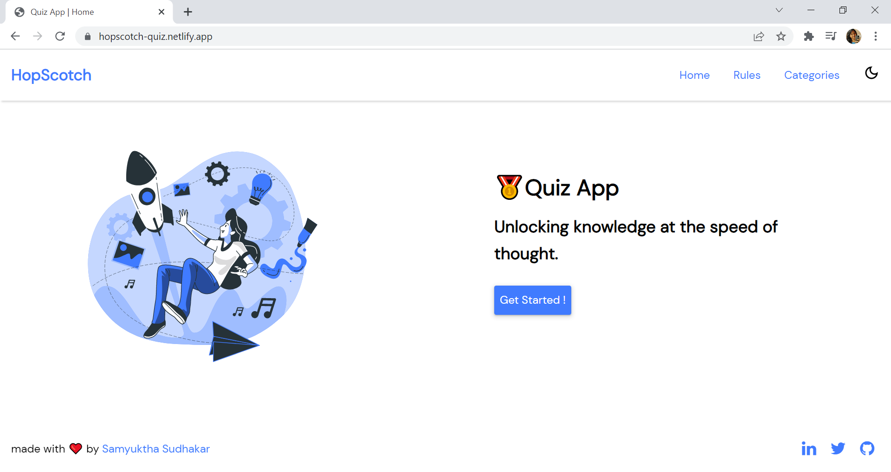
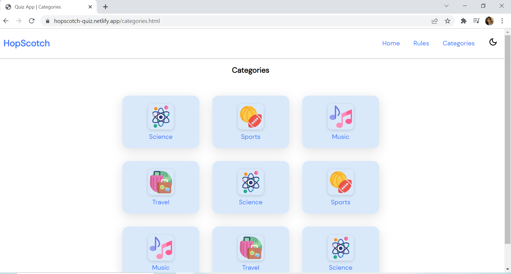
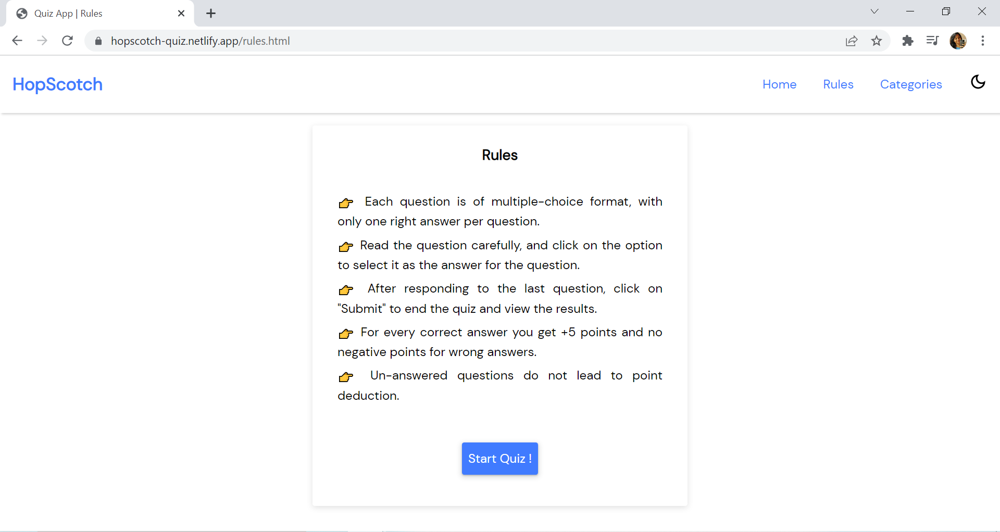
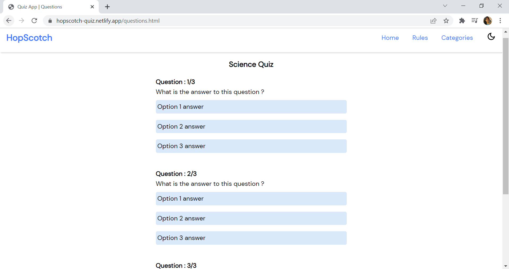
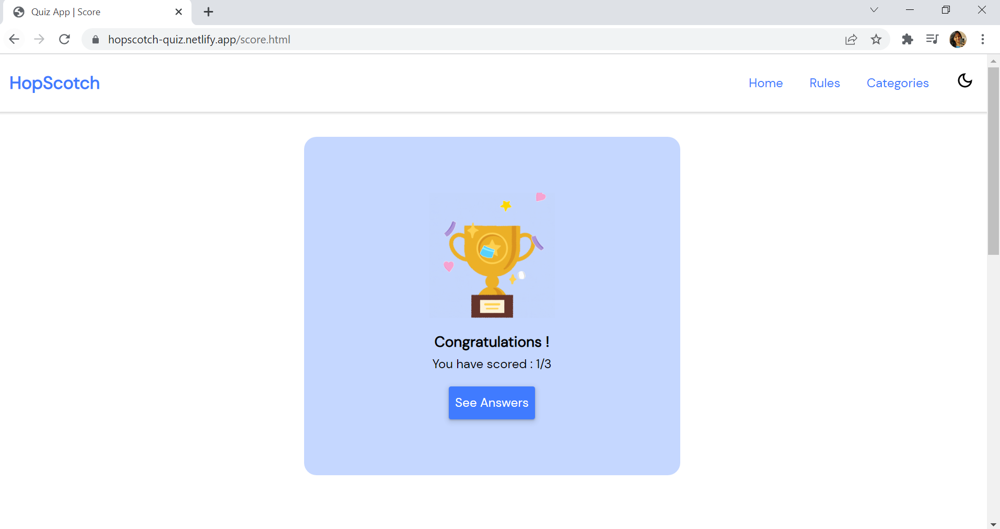
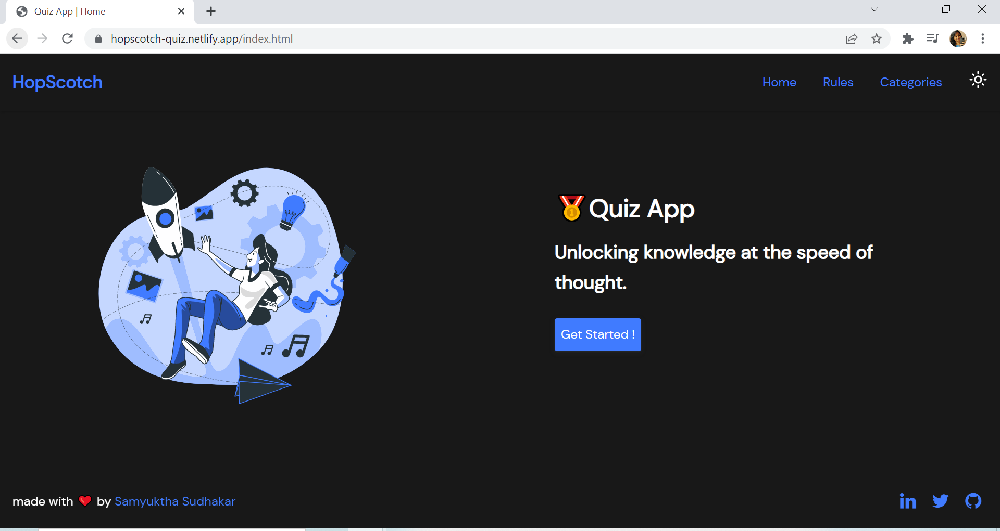
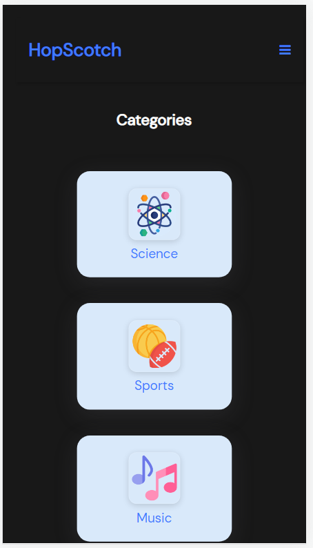

<h1>HopScotch</h1>

## 📑Table of contents 

- [Introduction](#introduction)
- [Screens](#screens)
- [Special Features](#special-features)
- [Connect With Me](#connect-with-me)

## 🧩Introduction
" HopScotch " is a quiz application consisting of various categories like music, science, sports etc built using HTML and CSS (at the moment).

## 💻Screens
The application consists of the following screens :
- [Home Page](#home-page)
- [Quizzes by Category](#quizzes-by-category)
- [Rules Page ](#rules-page)
- [Questions Page](#questions-page)
- [Result Page](#result-page)

#### Home Page

#### Quizzes by Category  

#### Rules Page 

#### Questions Page 

#### Result Page 

## ✨Special Features
The quiz app has the following special features :

- [Persistent Dark Mode](#persistent-dark-mode)
- [Responsive Screens](#responsive-screens)

#### Persistent Dark Mode

#### Responsive Screens

## 👩🏽‍💻Connect with me

